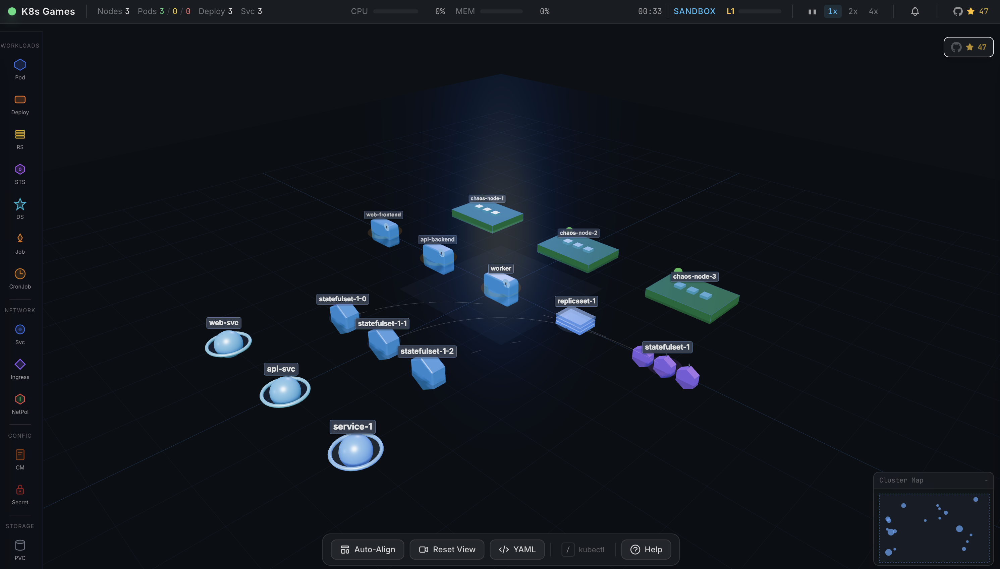

🚀 K8s Games
Master Kubernetes Through an Immersive 3D Gaming Experience

K8s Games

Learn Kubernetes the fun way — deploy workloads, debug production failures, run real kubectl commands, and manage cloud-native infrastructure inside a fully interactive 3D cluster simulator that runs directly in your browser.

No setup. No signup. Just pure Kubernetes learning through gameplay.

🌌 Why K8s Games?

K8s Games transforms Kubernetes training into a hands-on visual adventure.

Instead of reading endless docs or memorizing commands, you:

⚡ Deploy real Kubernetes resources visually
🔥 Diagnose production incidents like an SRE
🎮 Play through missions, chaos engineering, and timed challenges
🧠 Learn networking, scaling, RBAC, storage, and troubleshooting naturally
🖥️ Use real kubectl workflows inside the game
🌐 Build and visualize complete architectures in 3D

Whether you're a beginner learning Pods or an experienced engineer preparing for CKA/CKAD interviews, K8s Games gives you practical experience in a fun, modern environment.

🎯 Play Instantly
🌍 Browser Version

Visit: 

Learn Kubernetes by playing. Deploy pods, fix CrashLoopBackOff, type real kubectl commands — all in a 3D sim that runs in your browser.

**[Play Now at k8sgames.com](https://k8sgames.com)** | **[K8s Draw — 3D Architecture Diagrams](https://k8sgames.com/draw)**

## Get Started

Visit **[k8sgames.com](https://k8sgames.com)** and pick a mode. No install, no signup, no build step.

Just here to diagram? Go straight to **[k8sgames.com/draw](https://k8sgames.com/draw)** — drag K8s resources onto a 3D canvas, draw connections, export YAML or PNG, and share via URL.

Launch K8s Games

🧩 Kubernetes Architecture Whiteboard

Design clusters visually in 3D:

Open K8s Draw

⚡ Run Locally
git clone https://github.com/rohitg00/k8sgames.git
cd k8sgames

python3 -m http.server 8080
# Open http://localhost:8080
🎮 Game Modes
Mode	Experience
🚀 Campaign	Progress through 20 handcrafted levels covering Pods, Deployments, Services, Storage, Networking, and Production Operations
☠️ Chaos Mode	Endless Kubernetes disaster survival. Failures escalate until your cluster collapses
🏗️ Sandbox	Build any architecture freely and receive intelligent architecture scoring
⏱️ Challenges	Timed real-world troubleshooting scenarios with operational objectives
🧱 K8s Draw — 3D Kubernetes Diagram Builder
Like Excalidraw — Built Specifically for Kubernetes

Create production-ready Kubernetes architecture diagrams visually.

✨ Features
🎨 Drag & drop Kubernetes resources onto a 3D canvas
🔗 Connect workloads, services, storage, and networking visually
🧠 Smart auto-layout by infrastructure tier
📤 Export production YAML instantly
🖼️ Export diagrams as PNG
🌍 Share complete architectures using a URL
🏷️ Edit namespaces, labels, replicas, selectors, and metadata
⚡ One-click Service ↔ Deployment connections
🧩 21+ Kubernetes resource types supported

Perfect for:

System design interviews
DevOps documentation
Architecture discussions
Learning Kubernetes visually
Team collaboration
🔥 Real Kubernetes Incidents

Train using realistic production failures inspired by actual Kubernetes operations.

Included Failure Scenarios
💥 CrashLoopBackOff
🧠 OOMKilled
📦 ImagePullBackOff
🌐 DNS failures
💾 PVC Pending
⚠️ Node NotReady
🔒 Certificate expiry
📉 HPA flapping
🚦 Rollout failures
🐢 API throttling
🔥 And 20+ more production incidents

Investigate using:

kubectl get
kubectl describe
kubectl logs
rollout commands
scaling commands
node operations
live metrics

Just like real Kubernetes operations.

⌨️ Built-In kubectl Terminal

Use actual Kubernetes-style commands directly inside the game.

Supported Examples
get pods
describe deployment nginx
logs pod-1
scale deployment nginx --replicas=3
rollout status deployment/api
drain node-1
Features
✅ Tab completion
✅ Resource discovery
✅ Realistic outputs
✅ Interactive debugging workflows
🎯 Core Features
🧩 25 Kubernetes Resources

Includes:

Pods
Deployments
ReplicaSets
StatefulSets
DaemonSets
Jobs & CronJobs
Services & Ingress
ConfigMaps & Secrets
PVC / PV / StorageClass
Namespaces
HPA
RBAC Resources
Network Policies
Resource Quotas
PodDisruptionBudgets

Every resource has:

Unique 3D visuals
Real Kubernetes behavior
Interactive editing
Relationship mapping
🔗 Intelligent Visual Connections

Animated infrastructure relationships show:

Deployment → ReplicaSet → Pod ownership
Service → Pod routing
Namespace grouping
Storage attachments
Networking flow

Understand Kubernetes visually instead of mentally mapping YAML.

🛡️ RBAC Simulation

Practice Kubernetes security concepts using:

ServiceAccounts
Roles
ClusterRoles
RoleBindings
ClusterRoleBindings

Includes:

Rule visualization
Wildcard detection
Permission simulation
Access troubleshooting
🧠 Architecture Advisor

Your cluster is automatically analyzed across:

High Availability
Scalability
Security
Reliability
Cost Efficiency
Resource Design
Production Readiness

Receive an overall infrastructure score from 0–100.

🏆 Progression System
🎖️ 40 unlockable achievements
📈 30-level XP system
🧠 Progress from beginner to Kubernetes expert
🎯 Designed for CKA-style operational learning
🎮 Controls
Key	Action
/	Open kubectl command bar
?	Help & controls
Space	Pause / Resume
M	Metrics dashboard
Esc	Back to menu
1-9	Quick resource selection
Mouse Controls
Left Click → Select resource
Left Drag → Move resource / rotate camera
Right Click → Context menu
Right Drag → Pan camera
Scroll → Zoom
⚙️ Technology Stack

Built using modern browser-native technologies:

Three.js r152
Tailwind CSS
Vanilla ES6 Modules
No frameworks
No bundlers
No build step
Lightweight architecture
~50,000+ lines across 90+ files

Runs entirely in the browser.

🌟 Who Is This For?
Perfect For
Kubernetes beginners
DevOps engineers
Cloud engineers
SREs
Platform engineers
Students preparing for:
CKA
CKAD
CKS
Teams teaching Kubernetes internally
🚀 Start Playing
🎮 Launch Game

Play K8s Games Now

🧱 Open Architecture Builder

Open K8s Draw

📜 License

Apache-2.0
